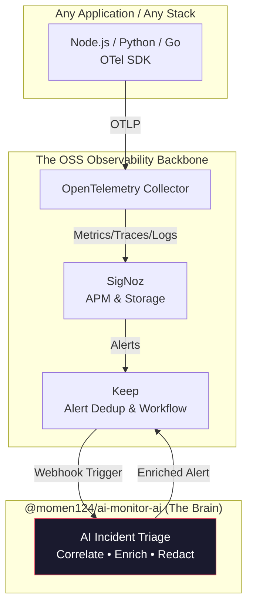

# @momen124/ai-monitor-sdk

[](https://github.com/AKER-LINK/ai-monitor-sdk/actions/workflows/ci.yml)
[](LICENSE)

**Self-hostable AI SRE service — monitors any project, any stack, any architecture.** 

Instead of an in-process library, the AI Monitor is a standalone service that ingests telemetry via OpenTelemetry, stores it in SigNoz, and uses LLMs to triage incidents, find root causes, and alert your team via Telegram or Slack.

---

## The V2 Architecture


```mermaid
graph TB
    subgraph "Any Application / Any Stack"
        APP[Node.js / Python / Go<br/>OTel SDK]
    end

    subgraph "The OSS Observability Backbone"
        OTEL[OpenTelemetry Collector]
        SIG[SigNoz<br/>APM & Storage]
        KEEP[Keep<br/>Alert Dedup & Workflow]
    end

    subgraph "@momen124/ai-monitor-ai (The Brain)"
        AI_ENGINE[AI Incident Triage<br/>Correlate • Enrich • Redact]
    end

    APP -- OTLP --> OTEL
    OTEL -- Metrics/Traces/Logs --> SIG
    SIG -- Alerts --> KEEP
    KEEP -- Webhook Trigger --> AI_ENGINE
    AI_ENGINE -- Enriched Alert --> KEEP

    style AI_ENGINE fill:#1a1a2e,stroke:#e94560,color:#fff
```

### Stack-Agnostic by Design

Because the AI Monitor delegates raw telemetry collection to **OpenTelemetry**, it can monitor anything:

- **Any Language**: Node.js, Python, Go, Java, .NET, Ruby, Rust, PHP.
- **Any Architecture**: Monoliths, Microservices (with distributed trace correlation), Serverless, or Kubernetes (via Coroot eBPF).
- **Zero Maintenance Infra**: Alert deduplication, maintenance windows, and incident routing are handled natively by **Keep**. Long-term storage and dashboards are handled by **SigNoz**.

> **The SDK's Moat:** We only build the AI intelligence layer. 100% of our code focuses on prompt engineering, hallucination prevention, log correlation, and actionable remediation.

## 📦 Packages

| Package                                                                       | Description                                                                                 |
| ----------------------------------------------------------------------------- | ------------------------------------------------------------------------------------------- |
| **[@momen124/ai-monitor-ai](./packages/ai-monitor-ai)**                           | **The LLM Brain**. Context compression, PII redaction, provider adapters (OpenAI/Ollama).   |
| **[@momen124/ai-monitor-otel](./packages/ai-monitor-otel)**                       | Thin wrapper presets for `@opentelemetry/auto-instrumentations-node`.                       |
| **[@momen124/ai-monitor-core](./packages/ai-monitor-core)**                       | Shared configs, ConfigBuilder, and integration hooks for Keep/GlitchTip.                    |

## 🚀 Quickstart

### 1. Deploy the AI SRE Stack

The easiest way to run the full observability backbone (SigNoz + Keep + OTel Collector) alongside the AI brain.

```bash
git clone https://github.com/AKER-LINK/ai-monitor-sdk.git
cd ai-monitor-sdk/examples/standalone-infra

cp .env.example .env
# Add your OpenAI key and Telegram/Slack tokens

docker compose up -d
# SigNoz APM: http://localhost:3301
# Keep UI:    http://localhost:8080
```

### 2. Instrument Your Node.js App

For Node.js apps, use our thin OpenTelemetry preset to automatically ship metrics, logs, and traces to the Collector.

```bash
pnpm add @momen124/ai-monitor-otel @opentelemetry/auto-instrumentations-node
```

```typescript
import { initTelemetry } from "@momen124/ai-monitor-otel";

// Run this BEFORE importing express, nestjs, mongoose, etc.
initTelemetry({
  serviceName: "my-api",
  endpoint: "http://localhost:4318/v1/traces" // Points to OTel Collector
});
```

*(Note: For Python, Go, or Java, simply use their standard OpenTelemetry SDKs pointing to the same endpoint.)*

## 🛠️ Development

```bash
# Install dependencies
pnpm install

# Build all packages
pnpm run build

# Run tests
pnpm run test

# Run tests with coverage
pnpm run test:coverage
```

## 📋 Environment Variables

See [`.env.example`](./.env.example) for all available configuration options.

## 🔄 CI/CD

- **CI**: Runs on every push to `main` and all PRs (Node 18 + 20)
- **Publish**: Triggered on Git tags `v*` — publishes all packages to npm

## 📖 Changelog

See [CHANGELOG.md](./CHANGELOG.md) for release history.

## 🚀 Deployment & Resources

- [V2 Architecture Vision](./docs/architecture/v2-vision.md) — Read about the shift to a standalone service.
- [Tools & Ecosystem Guide](./docs/12-tools-and-ecosystem.md) — Comprehensive breakdown of SigNoz, Keep, OpenTelemetry, and the AI Brain.

## 📄 License

MIT © AKER Team
