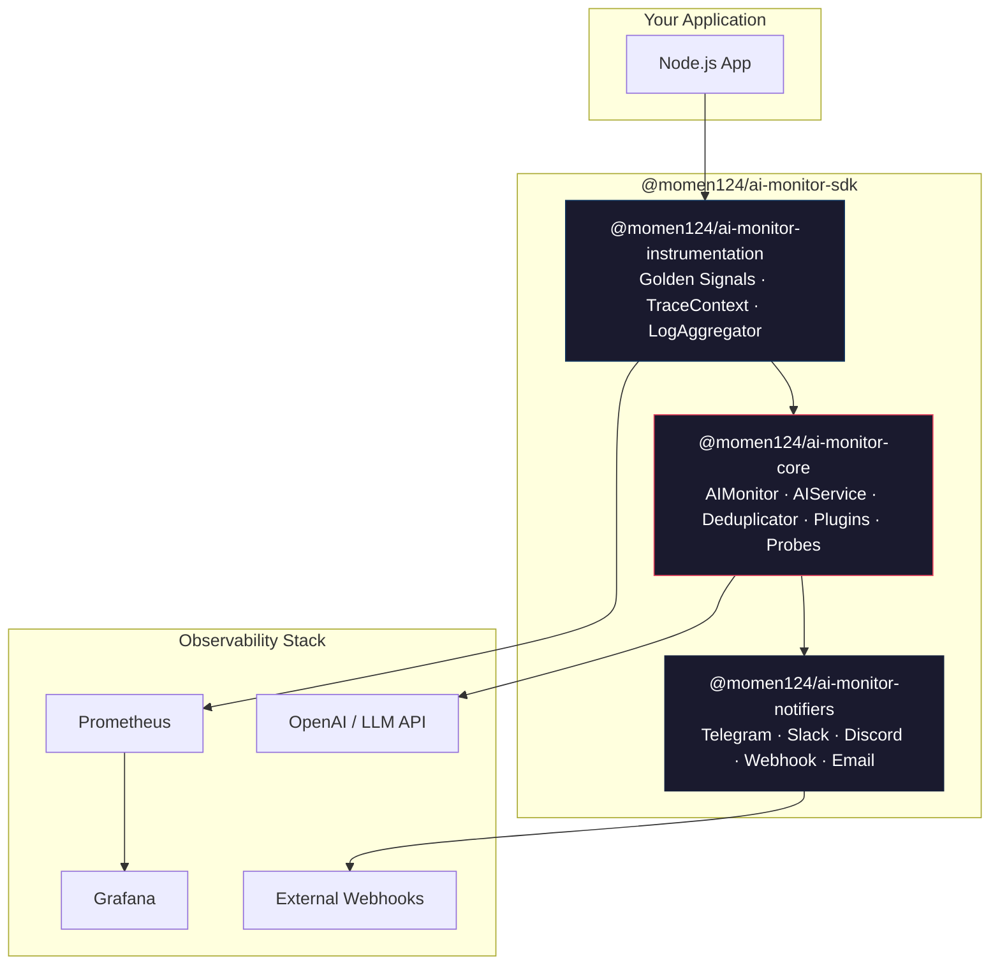

# @momen124/ai-monitor-sdk

[](https://github.com/AKER-LINK/ai-monitor-sdk/actions/workflows/ci.yml)
[](LICENSE)

**Plug-and-play AI-powered monitoring for any Node.js application.** Drop it in, configure, and start monitoring with intelligent alerting, anomaly detection, and auto-healing suggestions.

---

## Architecture & Supported Paradigms


```mermaid
graph TB
    subgraph "Your Application"
        APP[Node.js App]
    end

    subgraph "@momen124/ai-monitor-sdk"
        CORE["@momen124/ai-monitor-core<br/>AIMonitor · AIService · Deduplicator · Plugins · Probes"]
        INST["@momen124/ai-monitor-instrumentation<br/>Golden Signals · TraceContext · LogAggregator"]
        NOTIF["@momen124/ai-monitor-notifiers<br/>Telegram · Slack · Discord · Webhook · Email"]
    end

    subgraph "Observability Stack"
        PROM[Prometheus]
        GRAF[Grafana]
        AI[OpenAI / LLM API]
        WEBHOOK[External Webhooks]
    end

    APP --> INST
    INST --> CORE
    CORE --> NOTIF
    CORE --> AI
    NOTIF --> WEBHOOK
    INST --> PROM
    PROM --> GRAF

    style CORE fill:#1a1a2e,stroke:#e94560,color:#fff
    style INST fill:#1a1a2e,stroke:#0f3460,color:#fff
    style NOTIF fill:#1a1a2e,stroke:#16213e,color:#fff
```

### Built for Any Architecture

The AI Monitor SDK is designed to be highly robust and loosely coupled, making it perfectly suited for:

- **Microservices & Distributed Systems**: Pass trace IDs across boundaries; aggregate scattered logs into single AI analyses.
- **Monorepos**: Instrument multiple apps within a single workspace via shared metric exporters.
- **Monolithic Applications**: Low-overhead internal probing and holistic system health checks.
- **Event-Driven Architectures**: Hook directly into queue consumers (Kafka, RabbitMQ) to track processing latency and failures independently.
- **Serverless (AWS Lambda, etc.)**: Configurable flush intervals and connectionless observability patterns (using direct webhooks or OTEL-compliant fire-and-forget streams).

> **Production Ready / Robustness**: The SDK employs intelligent HTTP circuit breakers, built-in alert deduplication, payload size limiting to prevent memory/CPU exhaustion (e.g., maximum 1MB body), and strict request timeouts to ensure the monitor *never* brings down the host application.

## 📦 Packages

| Package                                                                       | Description                                                                                 |
| ----------------------------------------------------------------------------- | ------------------------------------------------------------------------------------------- |
| **[@momen124/ai-monitor-core](./packages/ai-monitor-core)**                       | Core monitoring, AI analysis, **Alert Deduplication**, **Health Probes**, **Plugin System** |
| **[@momen124/ai-monitor-instrumentation](./packages/ai-monitor-instrumentation)** | Golden Signals, **Distributed Tracing**, **Log Aggregation**, Prometheus exporter           |
| **[@momen124/ai-monitor-notifiers](./packages/ai-monitor-notifiers)**             | **Discord**, **Webhook**, Telegram, Slack, Email, Multi-channel                             |

## 🚀 Quickstart

### As a Library

```bash
pnpm add @momen124/ai-monitor-core @momen124/ai-monitor-notifiers
```

```typescript
import { AIMonitor } from "@momen124/ai-monitor-core";
import { TelegramNotifier } from "@momen124/ai-monitor-notifiers";

const monitor = new AIMonitor({
  port: 3333,
  notifiers: [
    new TelegramNotifier({
      token: process.env.TELEGRAM_BOT_TOKEN!,
      chatId: process.env.TELEGRAM_CHAT_ID!,
    }),
  ],
  aiConfig: {
    enabled: true,
    apiKey: process.env.AI_API_KEY,
  },
});

await monitor.start();

// Send alerts manually
await monitor.alert({
  severity: "WARNING",
  title: "High Memory",
  message: "Memory usage at 85%",
});
```

### With Auto-Instrumentation

```typescript
import { Instrumentation } from "@momen124/ai-monitor-instrumentation";

const instrumentation = new Instrumentation({
  monitor,
  appName: "my-api",
  thresholds: {
    cpu: { warning: 0.5, critical: 0.7 },
    memory: { warning: 0.6, critical: 0.8 },
  },
});

instrumentation.start();

// Express middleware — auto-tracks all HTTP requests
app.use(instrumentation.httpMiddleware());
```

### With Docker

```bash
cp .env.example .env
# Edit .env with your credentials

docker compose up -d
# Monitor:    http://localhost:3333/health
# Prometheus: http://localhost:9090
# Grafana:    http://localhost:3000
```

## 🛠️ Development

```bash
# Install dependencies
pnpm install

# Build all packages
pnpm run build

# Run tests
pnpm run test

# Run tests with coverage
pnpm run test:coverage
```

## 📋 Environment Variables

See [`.env.example`](./.env.example) for all available configuration options.

## 🔄 CI/CD

- **CI**: Runs on every push to `main` and all PRs (Node 18 + 20)
- **Publish**: Triggered on Git tags `v*` — publishes all packages to npm

## 📖 Changelog

See [CHANGELOG.md](./CHANGELOG.md) for release history.

## 🚀 Deployment & Resources

- [Deployment Guide](./docs/DEPLOYMENT.md) — How to update existing installations.
- [Production Setup Guide](./docs/PRODUCTION_SETUP.md) — **Start Here** for new servers (includes Visualization & AI setup).
- [Tools & Ecosystem Guide](./docs/12-tools-and-ecosystem.md) — Comprehensive breakdown of all internal, developer, and observability tools used by this SDK.

## 📄 License

MIT © AKER Team
