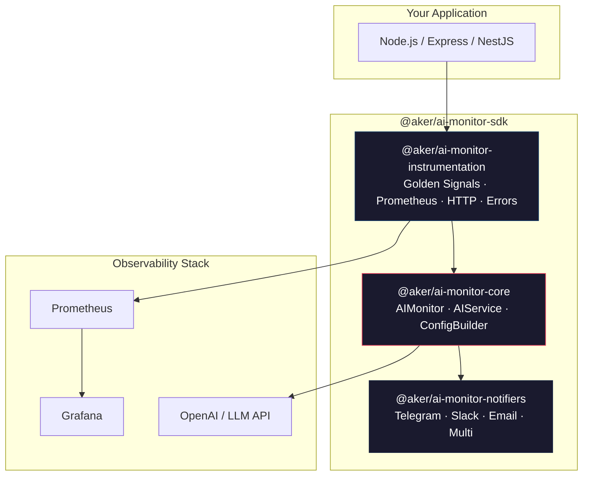
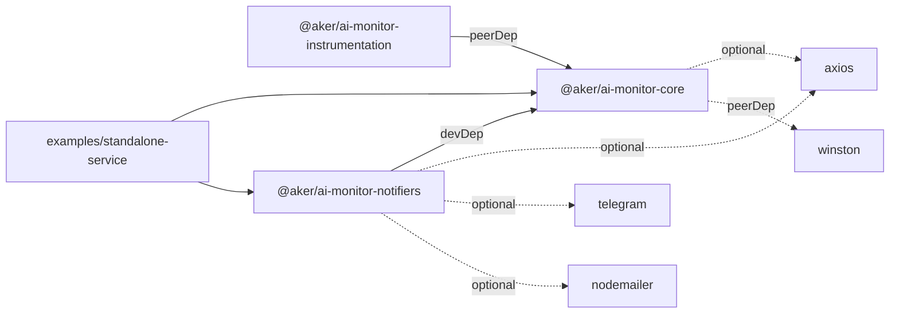
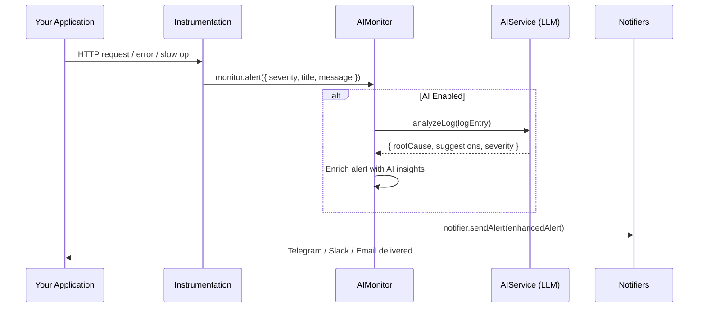
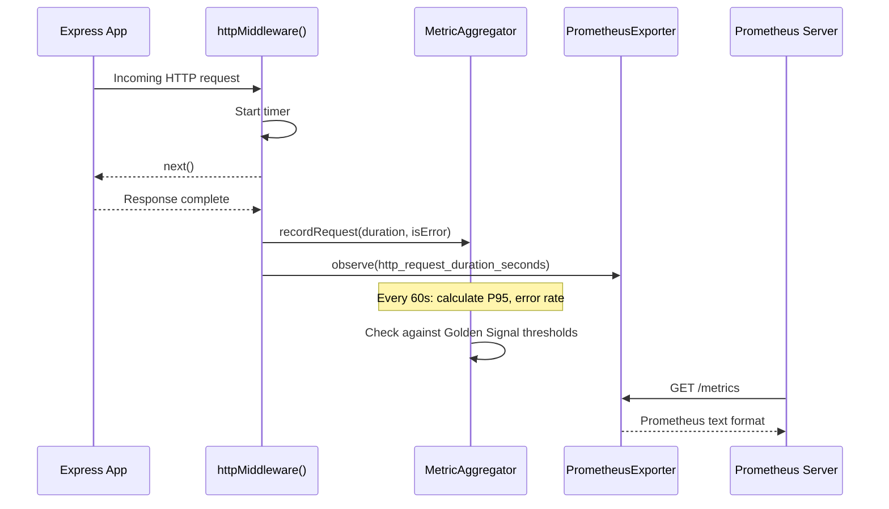

# Architecture & Design

> **@aker/ai-monitor-sdk** — Plug-and-play AI-powered monitoring for any Node.js application.

---

## High-Level Architecture



## Design Principles

| Principle              | How It's Applied                                                                                        |
| ---------------------- | ------------------------------------------------------------------------------------------------------- |
| **Plug-and-Play**      | Install, configure, call `.start()` — zero boilerplate                                                  |
| **Modular**            | Three independent packages — use only what you need                                                     |
| **AI-Native**          | Every alert can be enriched by LLM analysis before delivery                                             |
| **Zero-Lock-In**       | All notifier dependencies are **optional peer deps** — bring your own `axios`, `telegram`, `nodemailer` |
| **SRE Best Practices** | Golden Signals (Latency, Traffic, Errors, Saturation) baked in by default                               |
| **Observable**         | Built-in Prometheus exporter compatible with any Grafana dashboard                                      |

---

## Package Dependency Graph



**Key insight:** `ai-monitor-core` has **zero runtime dependencies**. Axios is loaded dynamically only when AI analysis is enabled. Every notifier channel is an optional peer dependency — you install only the extras you actually want.

---

## Data Flow

### 1. Alert Flow



### 2. Metrics Flow



---

## Golden Signals — Default Thresholds

The SDK implements the four Golden Signals from Google's SRE handbook, extended with saturation metrics:

| Signal         | Metric            | Warning  | Critical | Action             |
| -------------- | ----------------- | -------- | -------- | ------------------ |
| **Latency**    | P95 Response Time | > 200 ms | > 500 ms | Optimize queries   |
| **Errors**     | Error Rate (%)    | > 0.1%   | > 1.0%   | Investigate errors |
| **Saturation** | CPU Usage         | > 50%    | > 70%    | Scale up           |
| **Saturation** | Memory Usage      | > 60%    | > 80%    | Check for leaks    |
| **Saturation** | DB Connections    | > 50%    | > 80%    | Increase pool      |
| **Saturation** | Queue Length      | > 100    | > 1000   | Add workers        |

All thresholds are fully configurable via the `thresholds` option in `IInstrumentationConfig`.

---

## Package Breakdown

### `@aker/ai-monitor-core`

The brain. Contains the `AIMonitor` HTTP server, `AIService` (LLM integration), `ConfigBuilder` (fluent API), and all shared type contracts (`INotifier`, `IAlert`, `ILogger`, etc.).

| Class                  | Purpose                                                                          |
| ---------------------- | -------------------------------------------------------------------------------- |
| `AIMonitor`            | Core monitoring server — starts HTTP endpoints, routes alerts to notifiers       |
| `AIService`            | LLM-powered analysis — log analysis, anomaly detection, auto-healing suggestions |
| `ConfigBuilder`        | Fluent builder with env-var auto-loading                                         |
| `ConsoleLogger`        | Default `ILogger` implementation                                                 |
| `WinstonLoggerAdapter` | Adapter for Winston logger                                                       |

### `@aker/ai-monitor-notifiers`

Notification delivery channels. Every notifier implements the `INotifier` interface and can format alerts, pipeline statuses, deployments, and daily reports.

| Class              | Channel                  | Requires     |
| ------------------ | ------------------------ | ------------ |
| `TelegramNotifier` | Telegram Bot API         | `telegram`   |
| `SlackNotifier`    | Slack Webhook            | `axios`      |
| `EmailNotifier`    | SMTP (nodemailer)        | `nodemailer` |
| `MultiNotifier`    | Composite of N notifiers | —            |

### `@aker/ai-monitor-instrumentation`

Auto-instrumentation layer. Hooks into your app's runtime to collect Golden Signal metrics with zero code changes.

| Class                     | Responsibility                                                     |
| ------------------------- | ------------------------------------------------------------------ |
| `Instrumentation`         | Orchestrator — starts/stops all collectors, provides middleware    |
| `SystemMetricsCollector`  | CPU & memory polling (interval-based)                              |
| `HttpInterceptor`         | Express middleware + raw HTTP server wrapping                      |
| `ErrorInterceptor`        | `uncaughtException` + `unhandledRejection` handlers                |
| `PerformanceMonitor`      | Manual + automatic operation timing                                |
| `MetricAggregator`        | Sliding-window P95 & error rate calculation                        |
| `PrometheusExporter`      | Zero-dependency `/metrics` endpoint (counters, gauges, histograms) |
| `ExternalResourceMonitor` | Pluggable DB connection & queue length checks                      |

---

## HTTP Endpoints

The `AIMonitor` server exposes three built-in endpoints:

| Method | Path        | Description               | Toggle                               |
| ------ | ----------- | ------------------------- | ------------------------------------ |
| `GET`  | `/health`   | Health check (JSON)       | `enableHealthEndpoint`               |
| `POST` | `/alert`    | Receive alerts via HTTP   | `enableAlertEndpoint`                |
| `POST` | `/pipeline` | Receive pipeline statuses | `enablePipelineEndpoint`             |
| `GET`  | `/metrics`  | Prometheus scrape target  | `enablePrometheus` (instrumentation) |

### Health Check Response

```json
{
  "status": "healthy",
  "enabled": true,
  "notifiers": 2,
  "timestamp": "2026-02-08T12:00:00.000Z"
}
```
