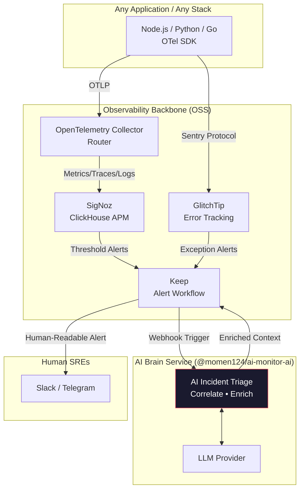
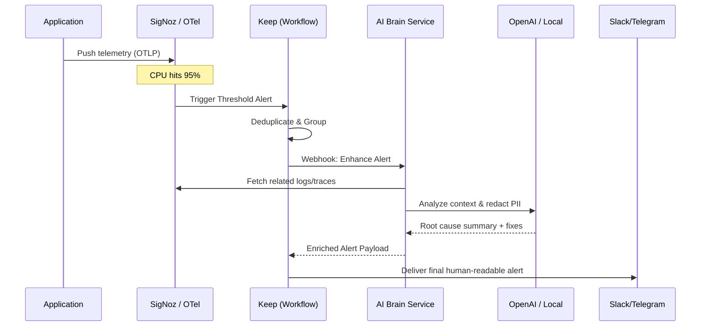

# Architecture & Design

> **@momen124/ai-monitor-sdk** — A standalone AI SRE service for monitoring *any* project on *any* stack.

---

## High-Level Architecture (V2)

```mermaid
graph TB
    subgraph "Any Application / Any Stack"
        APP[Node.js / Python / Go<br/>OTel SDK]
    end

    subgraph "Observability Backbone (OSS)"
        OTEL[OpenTelemetry Collector<br/>Router]
        SIG[SigNoz<br/>ClickHouse APM]
        KEEP[Keep<br/>Alert Workflow]
        GLITCH[GlitchTip<br/>Error Tracking]
    end

    subgraph "AI Brain Service (@momen124/ai-monitor-ai)"
        AI_ENGINE[AI Incident Triage<br/>Correlate • Enrich]
        LLM[LLM Provider]
    end

    subgraph "Human SREs"
        SLACK[Slack / Telegram]
    end

    APP -- OTLP --> OTEL
    APP -- Sentry Protocol --> GLITCH
    OTEL -- Metrics/Traces/Logs --> SIG
    SIG -- Threshold Alerts --> KEEP
    GLITCH -- Exception Alerts --> KEEP
    KEEP -- Webhook Trigger --> AI_ENGINE
    AI_ENGINE <--> LLM
    AI_ENGINE -- Enriched Context --> KEEP
    KEEP -- Human-Readable Alert --> SLACK

    style AI_ENGINE fill:#1a1a2e,stroke:#e94560,color:#fff
```

## Design Principles

| Principle                 | How It's Applied                                                                                        |
| ------------------------- | ------------------------------------------------------------------------------------------------------- |
| **Stack-Agnostic**        | Monitors any language or paradigm natively through OpenTelemetry standardization.                       |
| **OSS-Native Validation** | We don't reinvent the wheel. Storage is delegated to SigNoz. Notification routing is delegated to Keep. |
| **Fail-Open AI**          | The LLM enrichment layer sits asynchronously; if the LLM is down, raw alerts still reach the team.      |
| **Zero-Lock-In**          | Swap out OpenAI for a local Ollama model instantly via the provider abstraction.                        |
| **SRE Best Practices**    | Incident routing, maintenance windows, and rate-limiting happen at the platform layer (Keep).           |

---

## Data Flow

### 1. Alert Lifecycle

```mermaid
sequenceDiagram
    participant App as Application
    participant SigNoz as SigNoz / OTel
    participant Keep as Keep (Workflow)
    participant AI as AI Brain Service
    participant LLM as OpenAI / Local
    participant Chat as Slack/Telegram

    App->>SigNoz: Push telemetry (OTLP)
    Note over SigNoz: CPU hits 95%
    SigNoz->>Keep: Trigger Threshold Alert
    Keep->>Keep: Deduplicate & Group
    Keep->>AI: Webhook: Enhance Alert
    AI->>SigNoz: Fetch related logs/traces
    AI->>LLM: Analyze context & redact PII
    LLM-->>AI: Root cause summary + fixes
    AI-->>Keep: Enriched Alert Payload
    Keep->>Chat: Deliver final human-readable alert
```

---

## Package Breakdown

The SDK has been restructured into a standalone service with three lean packages:

### `@momen124/ai-monitor-ai` (The Moat)

This is the core intelligence engine. It is deployed as a standalone worker service.

| Component                   | Purpose                                                                          |
| --------------------------- | -------------------------------------------------------------------------------- |
| `IncidentEnricher`          | Coordinates fetching context and orchestrating the LLM.                          |
| `ProviderAdapter`           | Interfaces for OpenAI, Ollama, and internal LLMs.                                |
| `SigNozFetcher`             | Connects to ClickHouse to pull surrounding traces and logs for an incident.      |
| `RedactionPipeline`         | Strips PII, secrets, and truncates massive payloads before touching third-party APIs. |
| `EvaluationHarness`         | Offline testing suite to grade LLM summary quality and prevent hallucination regressions. |

### `@momen124/ai-monitor-otel`

A hyper-thin configuration wrapper. You only install this if you are instrumenting a Node.js application.

| Component                 | Responsibility                                                     |
| ------------------------- | ------------------------------------------------------------------ |
| `initTelemetry()`         | One-liner preset for `@opentelemetry/auto-instrumentations-node`   |
| `GoldenSignalsEnhancer`   | Enriches standard OTel traces to specifically highlight Google SRE signals. |

### `@momen124/ai-monitor-core`

The structural glue.

| Component              | Responsibility                                                     |
| ---------------------- | ------------------------------------------------------------------ |
| `ConfigBuilder`        | Fluent builder for loading service environment variables robustly. |
| `KeepWebhookBridge`    | Express/Fastify routes to receive payloads exclusively from Keep.  |
| `GlitchTipBridge`      | Adapters for Sentry-compatible payload ingestion.                  |

---

## Golden Signals

We still prioritize the four Golden Signals (Latency, Traffic, Errors, Saturation). However, instead of calculating these manually in memory, they are derived via **OpenTelemetry**:

- **Latency**: `http.server.duration` histograms.
- **Errors**: `http.server.requests` where `http.status_code >= 500`.
- **Traffic**: Request rates derived from OTel counters.
- **Saturation**: Pushed via the OTel host metrics receiver (CPU/Memory/Disk).

SigNoz provides the pre-built dashboards to visualize these natively.
