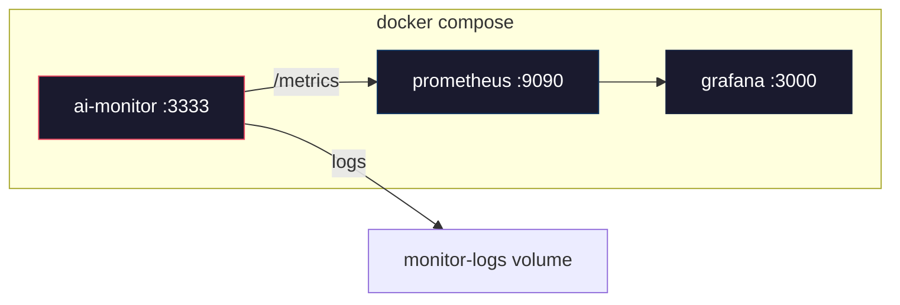

# Deployment & Operations Guide

> How to run the AI Monitor SDK in production — Docker, Prometheus, Grafana, CI/CD, and operational best practices.

---

## Docker Deployment

### Quick Start

```bash
cp .env.example .env
# Edit .env with your credentials (API keys, bot tokens, etc.)

docker compose up -d
```

This launches three services:

| Service      | Container         | Port   | Description                |
| ------------ | ----------------- | ------ | -------------------------- |
| `ai-monitor` | `aker-ai-monitor` | `3333` | The monitoring server      |
| `prometheus` | `aker-prometheus` | `9090` | Metrics scraping & storage |
| `grafana`    | `aker-grafana`    | `3000` | Dashboards & visualization |

### Service Endpoints

```
Monitor Health:  http://localhost:3333/health
Prometheus UI:   http://localhost:9090
Grafana UI:      http://localhost:3000  (admin/admin)
Metrics:         http://localhost:3333/metrics
```

### Docker Architecture



---

## Dockerfile

The SDK uses a **multi-stage Docker build** for minimal production images:

### Stage 1: Builder (`node:20-alpine`)

1. Copies workspace manifests (for layer caching)
2. Runs `pnpm install --frozen-lockfile`
3. Copies source and runs `pnpm run build`

### Stage 2: Runtime (`node:20-alpine`)

1. Copies only built `dist/` folders + `package.json` files
2. Installs **production dependencies only**
3. Creates `/app/logs` directory
4. Exposes port `3333`
5. Includes a `HEALTHCHECK` (wget to `/health`)

### Building Manually

```bash
docker build -t aker-ai-monitor .
docker run -p 3333:3333 --env-file .env aker-ai-monitor
```

---

## Prometheus Configuration

The included `prometheus/prometheus.yml`:

```yaml
global:
  scrape_interval: 15s
  evaluation_interval: 15s

scrape_configs:
  - job_name: "ai-monitor"
    static_configs:
      - targets: ["ai-monitor:3333"]
    metrics_path: "/metrics"
    scrape_interval: 10s
```

### Available Prometheus Metrics

| Metric                          | Type      | Labels             | Description             |
| ------------------------------- | --------- | ------------------ | ----------------------- |
| `http_request_duration_seconds` | histogram | `method`, `path`   | Request latency         |
| `http_requests_total`           | counter   | `method`, `status` | Total request count     |
| `process_cpu_usage_ratio`       | gauge     | —                  | CPU usage (0–1)         |
| `process_memory_usage_bytes`    | gauge     | —                  | Memory usage in bytes   |
| `db_connections_active`         | gauge     | —                  | Active DB connections   |
| `job_queue_length`              | gauge     | —                  | Current job queue depth |

### Example PromQL Queries

```promql
# Request rate (per second)
rate(http_requests_total[5m])

# P95 latency
histogram_quantile(0.95, rate(http_request_duration_seconds_bucket[5m]))

# Error rate (%)
rate(http_requests_total{status=~"5.."}[5m]) / rate(http_requests_total[5m]) * 100

# Memory usage (MB)
process_memory_usage_bytes / 1024 / 1024
```

---

## Grafana Configuration

Grafana is auto-provisioned with Prometheus as a datasource via `grafana/provisioning/datasources/datasource.yml`:

```yaml
apiVersion: 1
datasources:
  - name: Prometheus
    type: prometheus
    access: proxy
    url: http://prometheus:9090
    isDefault: true
    editable: true
```

### Creating a Dashboard

1. Open Grafana at `http://localhost:3000`
2. Log in with `admin` / `admin`
3. Go to **Dashboards → New Dashboard**
4. Add panels using the PromQL queries above

---

## CI/CD Pipelines

### Continuous Integration (`ci.yml`)

Triggers on every push to `main` and all pull requests:

| Step            | Description                                  |
| --------------- | -------------------------------------------- |
| Checkout        | Clone repository                             |
| Setup pnpm 9    | Install package manager                      |
| Setup Node.js   | Matrix: **Node 18** and **Node 20**          |
| Install deps    | `pnpm install --frozen-lockfile`             |
| Build           | `pnpm run build` (all packages)              |
| Test            | `pnpm run test:coverage`                     |
| Upload coverage | Artifacts retained for 7 days (Node 20 only) |

### Publishing (`publish.yml`)

Triggers on Git tags matching `v*`:

| Step                    | Description                                                |
| ----------------------- | ---------------------------------------------------------- |
| Build & Test            | Full build + test suite                                    |
| Publish core            | `pnpm publish --access public` for `@aker/ai-monitor-core` |
| Publish notifiers       | Same for `@aker/ai-monitor-notifiers`                      |
| Publish instrumentation | Same for `@aker/ai-monitor-instrumentation`                |

Requires `NPM_TOKEN` secret in GitHub repository settings.

### Release Workflow

```bash
# 1. Update versions in package.json files
# 2. Update CHANGELOG.md
# 3. Commit and tag
git add -A
git commit -m "chore: release v1.2.0"
git tag v1.2.0
git push origin main --tags
# Publish workflow triggers automatically
```

---

## Health Monitoring

### Health Check Endpoint

```bash
curl http://localhost:3333/health
```

```json
{
  "status": "healthy",
  "enabled": true,
  "notifiers": 2,
  "timestamp": "2026-02-08T12:00:00.000Z"
}
```

### Docker Health Check

The Dockerfile includes a built-in health check:

```dockerfile
HEALTHCHECK --interval=30s --timeout=10s --retries=3 --start-period=40s \
    CMD wget --quiet --tries=1 --spider http://localhost:3333/health || exit 1
```

Docker compose also defines the same check. Monitor container health with:

```bash
docker inspect --format='{{.State.Health.Status}}' aker-ai-monitor
```

---

## Graceful Shutdown

The standalone service example handles `SIGINT` and `SIGTERM`:

```typescript
process.on("SIGINT", async () => {
  await monitor.stop();
  process.exit(0);
});

process.on("SIGTERM", async () => {
  await monitor.stop();
  process.exit(0);
});
```

Always call `monitor.stop()` and `instrumentation.stop()` before exiting to cleanly:

- Close the HTTP server
- Clear all polling intervals
- Restore original process event listeners

---

## Volumes & Persistence

| Volume            | Mount              | Purpose                            |
| ----------------- | ------------------ | ---------------------------------- |
| `monitor-logs`    | `/app/logs`        | Application logs                   |
| `prometheus-data` | `/prometheus`      | Metrics storage (30-day retention) |
| `grafana-data`    | `/var/lib/grafana` | Dashboards & user config           |

### Log Rotation

The standalone service uses Winston with built-in rotation:

- **Max file size:** 5 MB
- **Max files:** 5 (automatic cleanup)
- **Format:** JSON (file) + colorized text (console)
