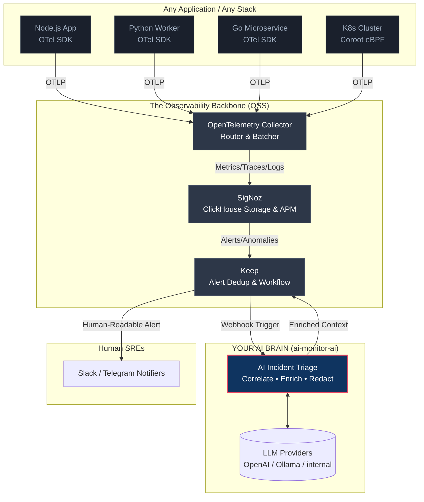

# AI Monitor V2 Vision: A Standalone AI SRE Service

## From SDK to Intelligent SRE

The AI Monitor was initially conceived as an **in-process Node.js library**—an SDK you `npm install` into a specific Express or NestJS application to track errors and enrich them via an LLM.

**V2 pivots this architecture.**

Instead of living *inside* one application, the AI Monitor is now a **standalone AI SRE service**. It sits downstream of your entire infrastructure, watching every log, trace, and metric across any language or architecture, identifying threats, finding root causes, and alerting your team.

Think of it as **a digital team member whose entire job is to watch the logs 24/7 and tell you when (and why) something breaks.**

---

## The Cross-Stack Architecture

To monitor *any* project with *any* stack, we delegate the heavy lifting of raw data collection and storage to established, industry-standard OSS tools. We only build what makes us unique: **the AI intelligence layer.**

---

## The Three Layers of V2

By adopting this architecture, we break the system into three distinct layers:

### 1. Telemetry & Ingestion (Delegated to OTel)
We no longer write custom `HttpInterceptors` or `SystemMetricsCollectors`.
Instead, applications use **OpenTelemetry (OTel)**. OTel provides zero-code auto-instrumentation for Node.js, Python, Java, Go, and more. It pushes all telemetry (logs, metrics, and traces) in a standardized format to the OTel Collector.

### 2. Storage & Control Plane (Delegated to SigNoz & Keep)
We no longer build custom Prometheus exporters, alert deduplication logic, or incident state machines.
- **SigNoz** acts as our long-term storage, providing out-of-the-box APM dashboards, service maps, and raw threshold alerts.
- **Keep** acts as our workflow engine. When SigNoz fires an alert, Keep deduplicates it, groups it, respects maintenance windows, and triggers our AI Brain.

### 3. The AI Enrichment Engine (What We Build)
This is our competitive moat. When an incident is triggered, our `ai-monitor-ai` service kicks in:
1. It reads the context of the incident.
2. It queries SigNoz for related logs and traces spanning the relevant timeframe.
3. It compresses this data, redacts PII, and constructs an intelligent prompt.
4. It queries the LLM to determine the probable cause, risk level, and recommended fix.
5. It returns this enriched payload to Keep, which formats it and delivers it to Slack or Telegram.

---

## Why This Matters

1. **Stack Agnostic:** Because we rely on the OTel standard, our AI Brain can monitor a Python Django backend and a Go microservice just as easily as a Node.js API.
2. **Zero Maintenance for Infrastructure:** We don't spend story points building alert rate limiters, backpressure queues, or database integrations. `Keep` and `SigNoz` do this natively.
3. **Laser Focus on AI:** 100% of our engineering effort goes into prompt engineering, context compression, hallucination prevention, and offline evaluation harnesses. We are building the smartest SRE, not the 100th metrics dashboard.
